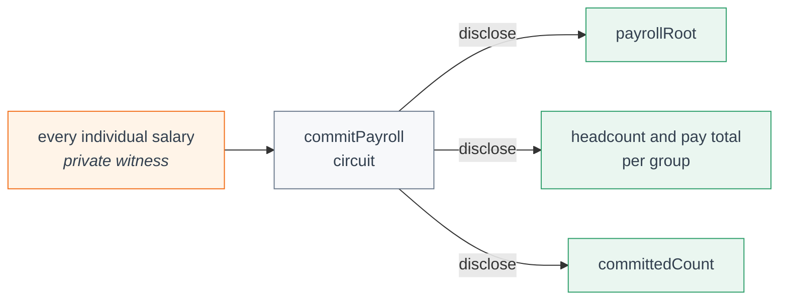
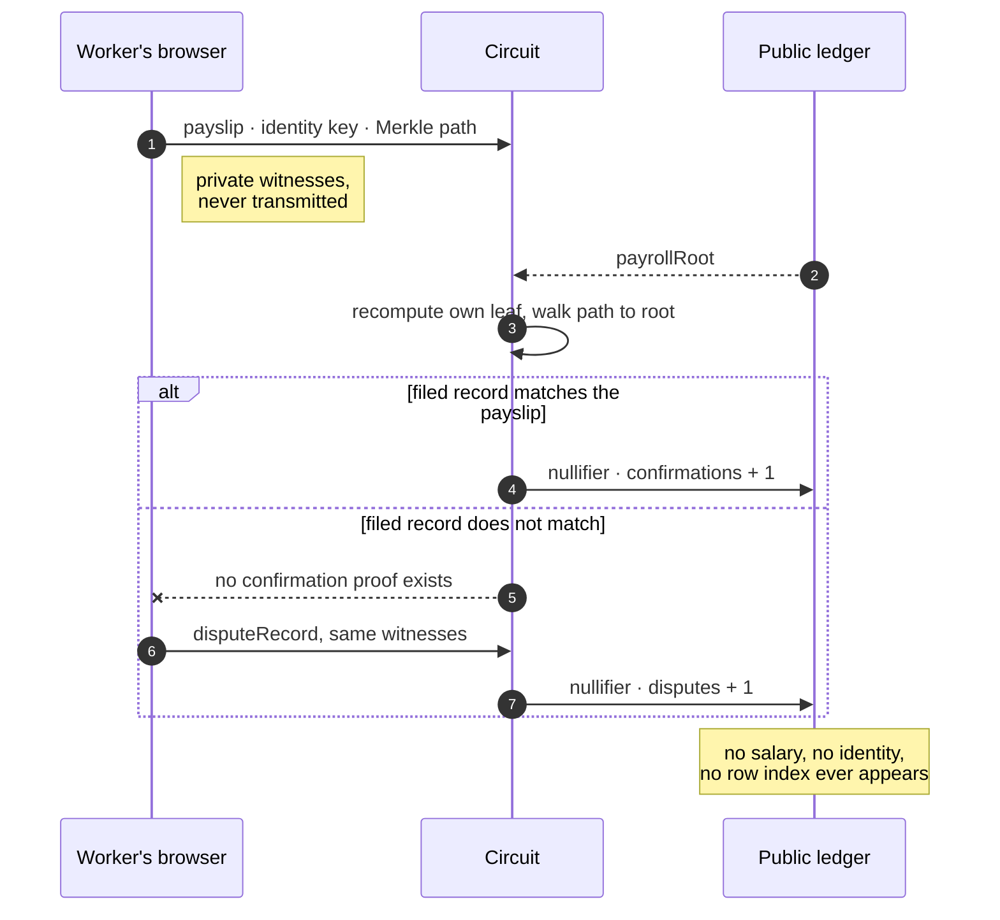

# Parity


> A gender pay-gap filing that can be verified — without anyone seeing a single salary.

## Live Demo

**https://parity-tech.vercel.app/**

## Demo Video

**Watch it: https://youtu.be/luBz-gQ5mzI**

Also in the repo at [docs/demo/parity-demo.mp4](docs/demo/parity-demo.mp4) — a 2m 39s walkthrough of the full flow:
the employer commits a payroll, the figures become public, workers confirm their own rows, and a
tampered filing is caught by a worker's dispute while no salary is ever exposed.

## Contract Address

| Network | Address                                                            |
|---------|--------------------------------------------------------------------|
| Preprod | `ed713051c3d2e0e138c4c509f976746de1f741492321f51e616d537fd641fafd` |

Deployed on Midnight Preprod (block 2,544,461, deploy tx
`cb1c779bd359bc5e93621030d54701536fca0b0f9a62818a0c37a39ad533fa48`). A headless alternative is
[`scripts/deploy-cli.ts`](scripts/deploy-cli.ts), run against a local proof server matching the
pinned ledger version (`midnightntwrk/proof-server:8.1.0`).

## User Validation

| Stage   | Target | Current | Wallet list                          |
|---------|--------|---------|--------------------------------------|
| Level 5 | 50     |       | [USERS.md](USERS.md)                 |
| Level 6 | 20     |       | [LAUNCH_USERS.md](LAUNCH_USERS.md)   |
| Total   | 70     | 81      |                                      |

See [docs/FEEDBACK.md](docs/FEEDBACK.md) for the feedback log and the changes it drove.

## What This Product Does

From 2027, every EU employer with 150+ staff must publish its gender pay gap under Directive
(EU) 2023/970. **Nobody can check whether that number is true.** The employer computes it from
its own payroll and files it, and verifying the arithmetic would require the individual
salaries — exactly what data-protection law forbids disclosing. So regulators are reduced to
guessing from the outside: the UK's regulator flags filings by *statistical implausibility*,
sent accuracy letters to 30 employers in 2024 and 42 in 2025, and has issued **zero fines to
date**. That is not weak enforcement; it is missing evidence. The same wall blocks workers: a
worker may legally request pay data for their job category, but in a category of three the
average identifies a colleague, so the employer must refuse.

Parity resolves it in three moves. The employer commits its payroll as a Merkle root, and the
published figures are computed from that same snapshot **inside one circuit** — so there is no
step at which a gap could be computed from one dataset and a different one committed. Then each
worker proves in zero knowledge that the record filed under their identity matches their own
payslip, and confirms or disputes it; one action each, enforced by a nullifier. What becomes
public is never a salary, but the **coverage figure** — *"10 records committed, 7 confirmed by
the worker, 1 disputed."* Records invented to move an average are never confirmed by anyone, so
they surface as a stalled confirmation rate. Fraud stops being one person editing a spreadsheet
and becomes a conspiracy that hundreds of people must actively join.

It is used by **employers** (who can finally evidence a figure, and answer individual pay
requests without data-protection exposure), by **workers** (who can check and challenge what was
filed about them), and by **works councils, unions, and regulators** (who get an integrity signal
instead of a database of salaries they would then have to defend). Midnight is required because
the Directive mandates the disclosure while the GDPR mandates the minimisation: both are legally
binding and in direct tension, so a conventional database (trust the holder) and a transparent
chain (publishes the salaries) are each ruled out — not merely worse. Midnight is where public
verifiable state and private witnesses live in one contract, and where `disclose(...)` makes the
complete disclosure surface auditable by a compliance reviewer rather than a promise about what a
server does.

## How It Works

**The employer files.** Salaries go *in* to a circuit; only a commitment and per-group
aggregates come *out*. Nothing on the right-hand side can identify a person.



The root and the totals leave the **same circuit invocation**, so there is no point at which the
gap could be computed from one dataset while a different one is committed. That is the whole
guarantee on the employer's side — and on its own it is not enough, because it says nothing
about whether the committed payroll is honest. That is what the workers are for.

## Privacy Model

- **What is PUBLIC (on-chain, anyone can see):**
  - `reportingPeriod` / `jobCategory` — which filing this contract instance covers.
  - `payrollRoot` — the Merkle root committing to the payroll snapshot.
  - `groupACount` / `groupBCount` — headcount per pay group.
  - `groupAPaySum` / `groupBPaySum` — **aggregate** pay per group (the gap is derived from these).
  - `committedCount`, `confirmations`, `disputes` — the coverage counters.
  - `nullifiers` — the set of spent action nullifiers.

- **What is PRIVATE (private witness, never on-chain):**
  - `employerSalaries()` / `employerIds()` / `employerGroupA()` / `employerActive()` — the full
    payroll snapshot, supplied by the employer.
  - `employeeSecretKey()` — the worker's identity key.
  - `employeeSalary()` / `employeeIsGroupA()` — the worker's own payslip values.
  - `merkleSiblings()` / `merklePathIndices()` — the private path proving which row is theirs.
  - `employerClaimedRecordHash()` — what the employer filed about this worker.

- **What the user PROVES without revealing:**
  - *Employer:* "the aggregates I am publishing were computed from exactly the snapshot committed
    in `payrollRoot`" — individual salaries are summed inside the circuit, and only per-group
    totals and counts are disclosed.
  - *Worker:* "the record filed under my identity matches my own payslip" — or, via
    `disputeRecord`, "it does not" — without revealing which leaf is theirs, what they earn, or
    what the employer claimed they earn.

### One worker, one check

The dispute path is the whole product. A worker whose filed record does not match their payslip
*cannot* produce a confirmation proof — the failure is arithmetic, not a policy decision — and
the dispute they file instead is what makes the tampering visible.



The nullifier is what makes this count for something: it is derived from the worker's identity
key and the filing, so each worker can act exactly once per filing, and the coverage figure
cannot be inflated by repeating a confirmation.

**Honest scope note.** An aggregate over a tiny group still leaks: with one worker in a group,
the group total *is* their salary. The contract therefore enforces a minimum publishable group
size of three and refuses the filing otherwise. A confirmation discloses that *someone*
confirmed — never who, and never their pay group. And zero-knowledge proves the arithmetic is
consistent with the committed data, not that the committed data is true; payroll-provider
countersigning is the real fix for that, and is future work. See
[docs/USAGE.md](docs/USAGE.md) for the full list.

## Tech Stack

Midnight network · Compact `0.23` · Midnight.js SDK · Lace wallet (DApp connector) ·
React 19 + Vite 7 · TypeScript · Vitest · GitHub Actions

## Prerequisites

- [Lace wallet](https://www.lace.io/) browser extension, funded from the
  [Preprod faucet](https://midnight-tmnight-preprod.nethermind.dev/)
- Node.js v22
- Docker (only if your wallet does not support delegated proving — see below)

## Setup & Run Locally

1. Clone and install:
   ```
   git clone https://github.com/artomily/parity.git && cd parity && npm install
   ```
2. Install the Compact compiler, if you do not have it:
   ```
   npm install -g @midnight-ntwrk/compact-compiler
   ```
3. Compile the contract (this generates `managed/`, including the ZK keys):
   ```
   npm run compact
   ```
4. Start a local proof server, only if your wallet cannot prove for you. The image tag must
   match the `@midnight-ntwrk/ledger-v8` version this repo pins — a mismatched proof server
   fails with a bare "Failed to prove transaction" and logs nothing useful:
   ```
   docker run -p 6300:6300 midnightntwrk/proof-server:8.1.0
   ```
5. Run the app:
   ```
   npm run dev
   ```
6. Open the printed URL, connect Lace, and follow [docs/USAGE.md](docs/USAGE.md).

## Run Tests

```
npm test
```

Ten tests run the *compiled* circuits through an in-memory simulator — no proof server or live
network needed. They cover the in-circuit aggregation, the Merkle record check, the coverage
counters, the nullifier set, the minimum-group-size rule, and an explicit assertion that no
individual salary ever reaches public ledger state.

To recompile the contract first:

```
npm run test:compile
```

## CI/CD

[`.github/workflows/ci.yml`](.github/workflows/ci.yml) runs on every push to `main` and on every
pull request. It checks out the repo, installs Node v22 and the dependencies, installs the Compact
compiler, compiles `contracts/parity.compact` from source, and runs the full test suite against
the freshly compiled circuits. `managed/` is deliberately not committed — CI regenerates it, so a
green badge means the contract in the repo genuinely compiles and its tests genuinely pass.

## Usage Guide

See [docs/USAGE.md](docs/USAGE.md).

## Feedback & Iterations

See [docs/FEEDBACK.md](docs/FEEDBACK.md).

Top changes planned from user feedback:

80 testers: 75% completed the full flow, 25% partly; average ease 4.64 / 5.

| Change | Testers asking |
|--------|----------------|
| Explicit transaction stepper (Building proof → Submitted → Confirmed) with tx hash and explorer link | 23 |
| Clear submitted/confirmed states, a more prominent success banner, plainer confirmation wording | 17 |
| Tooltips for Midnight terms, a clear call to action after each step, quick-start copy | 11 |
| Waiting message that explains proof generation and expected time | 7 |
| Descriptive button labels, stronger visual hierarchy, mobile spacing fixes | 7 |

Full breakdown in the Level 6 Improvements table in [docs/FEEDBACK.md](docs/FEEDBACK.md).

## Level 6 Users

See [LAUNCH_USERS.md](LAUNCH_USERS.md).

## Product X Profile

[**@paritycompany**](https://x.com/paritycompany)

## Brand Assets

| Asset | File |
|-------|------|
| Logo | [`brand/logo.svg`](brand/logo.svg) · [`brand/logo.png`](brand/logo.png) |
| Avatar | [`brand/avatar.svg`](brand/avatar.svg) · [`brand/avatar.png`](brand/avatar.png) |
| X banner | [`brand/x-banner.svg`](brand/x-banner.svg) · [`brand/x-banner.png`](brand/x-banner.png) |
| Launch post images | [`brand/posts/`](brand/posts/) |

Every PNG is rendered from the SVG beside it (`./brand/render.sh`). The brand brief is in
[docs/BRAND.md](docs/BRAND.md).
